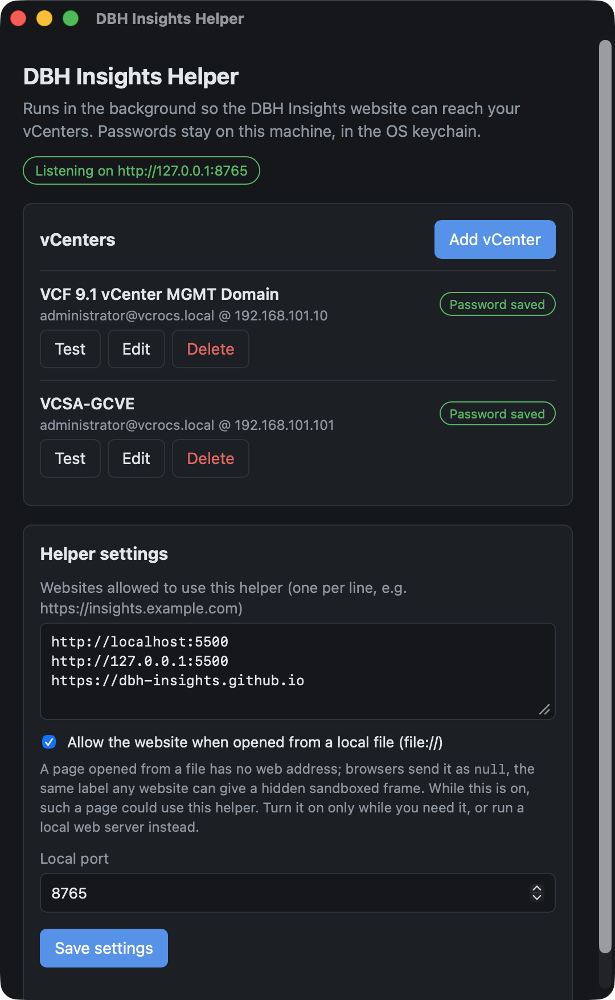
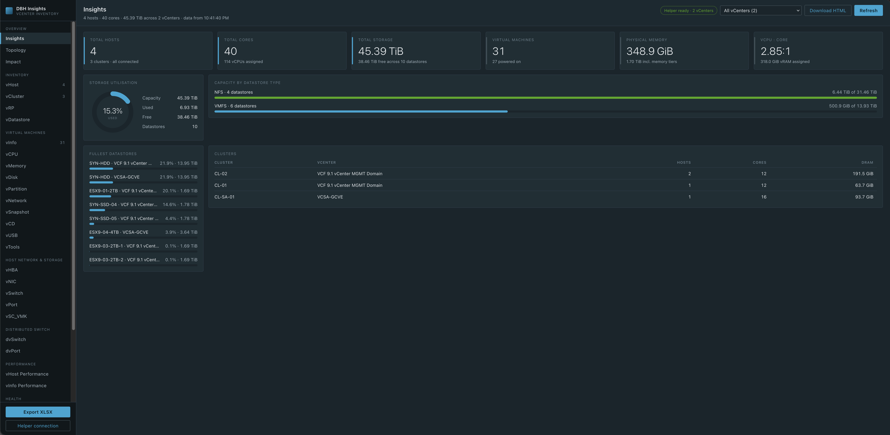
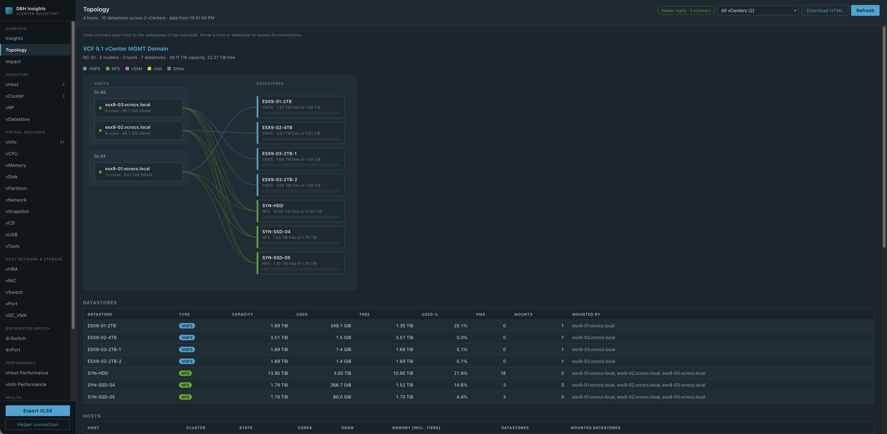
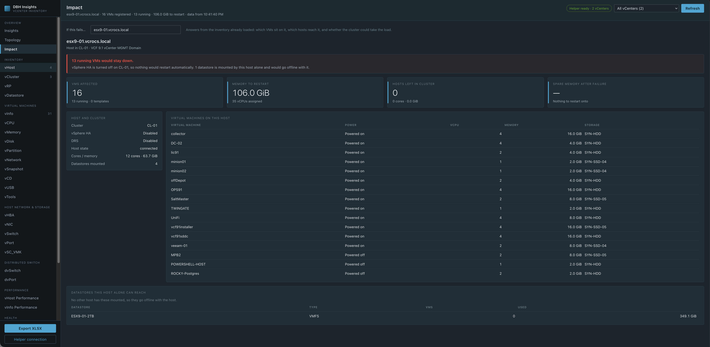
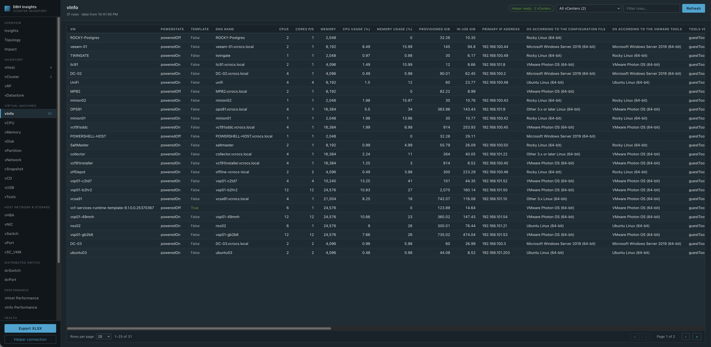
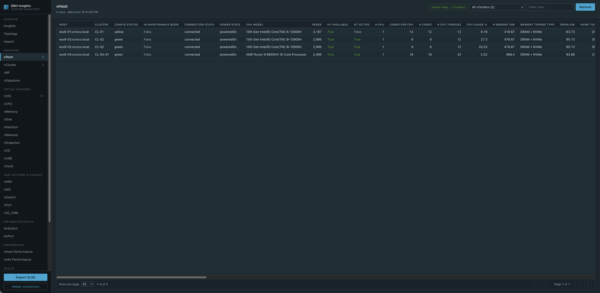

# DBH Insights

**Live site: https://dbh-insights.github.io/**

DBH Insights is a website that shows your VMware vCenter inventory: dashboards, a host-and-storage topology, failure impact, and 27 sortable sheets you can export to Excel. It works with a small helper app that you run on your own computer. The helper connects to your vCenters; the website only talks to the helper.

```
 Browser                                Your computer                   Your network
 ┌──────────────────────────┐   fetch   ┌─────────────────────┐  HTTPS  ┌──────────┐
 │ dbh-insights.github.io   │ ────────▶ │ DBH Insights Helper │ ──────▶ │ vCenter  │
 │ dashboards, sheets,      │ ◀──────── │ 127.0.0.1:8765      │ ◀────── │          │
 │ export                   │           │ creds in OS keychain│         │          │
 └──────────────────────────┘           └─────────────────────┘         └──────────┘
```

Your vCenter passwords stay in your computer's credential store (the macOS Keychain or Windows Credential Manager). They are never sent to the website, and the helper only reads from vCenter — it can't change anything.

## Getting started

1. [Install the helper](#install-the-helper) on your Mac or Windows PC.
2. [Add your vCenters](#add-your-vcenters) in the helper.
3. Open **https://dbh-insights.github.io/** in your browser. If the browser asks to allow access to devices on your local network, choose **Allow**.

The top bar shows the connection state. When it shows your vCenter login (for example `administrator@vsphere.local @ vcsa.lab.local`), you're ready.

## Install the helper

The helper is available for macOS and Windows. Install it on the computer where you'll open the website. That computer needs network access to your vCenters.

| Platform | Installer | Requirements |
|---|---|---|
| macOS | [DBH Insights Helper_0.3.0_aarch64.dmg](helper-app/DBH%20Insights%20Helper_0.3.0_aarch64.dmg) | Apple Silicon (M1 or later) |
| Windows | [DBH Insights Helper_0.3.0_x64-setup.exe](helper-app/DBH%20Insights%20Helper_0.3.0_x64-setup.exe) | Windows 10 or 11, 64-bit (x64) |

Each link opens the file's page on GitHub. Click the **Download raw file** button there to download it.

### macOS

1. Download the macOS installer: [DBH Insights Helper_0.3.0_aarch64.dmg](helper-app/DBH%20Insights%20Helper_0.3.0_aarch64.dmg).
2. Open the `.dmg` and drag **DBH Insights Helper** into **Applications**.
3. Open **DBH Insights Helper** from Applications.

The helper isn't signed with an Apple Developer ID, so macOS may stop it the first time you open it:

- **"Apple could not verify… is free of malware"** or **"can't be verified"**: click **Done**, open **System Settings → Privacy & Security**, scroll down, and click **Open Anyway**.
- **"DBH Insights Helper is damaged and can't be opened"**: the app isn't damaged; macOS quarantined it when it was downloaded. Don't move it to the Trash. Run this once in Terminal, then open the app again:

  ```bash
  xattr -dr com.apple.quarantine "/Applications/DBH Insights Helper.app"
  ```

  This removes only the quarantine flag macOS added to the downloaded app.

The helper runs in the menu bar. Closing its window leaves it running; use the menu bar icon to reopen the settings or to quit.

### Windows

1. Download the Windows installer: [DBH Insights Helper_0.3.0_x64-setup.exe](helper-app/DBH%20Insights%20Helper_0.3.0_x64-setup.exe).
2. Run the downloaded file and follow the setup wizard. It installs for your user account, so you don't need administrator rights. If Microsoft Edge WebView2 isn't already on the PC, setup downloads and installs it.
3. Open **DBH Insights Helper** from the Start menu.

The installer isn't code-signed, so Windows may warn you before it runs:

- **"Windows protected your PC"** (Microsoft Defender SmartScreen): click **More info**, check that the app is `DBH Insights Helper_0.3.0_x64-setup.exe`, then click **Run anyway**.
- **Your browser flags the download** (for example Edge says it "isn't commonly downloaded"): open the downloads list, choose **Keep** from the file's **…** menu, and confirm.

The helper runs in the system tray, at the right-hand end of the taskbar. If you can't see its icon, click the **^** arrow to show hidden icons. Closing its window leaves it running; right-click the tray icon to reopen the settings or to quit. The helper only listens on `127.0.0.1`, so Windows Firewall doesn't need to allow it.

To remove the helper, open **Settings → Apps → Installed apps**, find **DBH Insights Helper**, and choose **Uninstall**.

### Running the helper

On either platform, quitting the helper logs out of every vCenter session, and the website can't load data until you start the helper again.



## Add your vCenters

The first time the helper opens, its settings window appears.

1. Click **Add vCenter**.
2. Enter a name, the vCenter host name, a username and a password.
3. Click **Save & test**. The helper checks that it can log in.

Repeat for each vCenter. Every entry has **Test**, **Edit** and **Delete** buttons. A read-only vCenter account is enough.

The **General** settings hold:

- **Websites allowed to use this helper** — `https://dbh-insights.github.io` is already on the list, so the live site works without changes.
- **Allow the website when opened from a local file** — leave this off unless you need it (see [Security](#security)).
- **Port** — the helper listens on `127.0.0.1:8765` by default. Change it only if another app already uses that port.

Where the helper stores things:

| | macOS | Windows |
|---|---|---|
| Settings | `~/Library/Application Support/dev.dbhinsights.helper/config.json` | `%APPDATA%\dev.dbhinsights.helper\config.json` |
| Passwords | Keychain, service `dbh-insights-helper` | Credential Manager (Windows Credentials), under `dbh-insights-helper` |

## Using the website

### Choosing vCenters

With more than one vCenter set up, a picker appears in the top bar. Choose **All vCenters** to combine them, or pick one. Every sheet has a `VI SDK Server` column showing where each row came from. If one vCenter can't be reached, a warning appears and the rest still load.

Data is cached after it's first loaded, so switching views is quick. Click **Refresh** to fetch fresh data from vCenter.

### Insights

The headline numbers for the selected vCenters: hosts, cores, storage, VMs, memory and the vCPU-to-core ratio, plus storage utilisation, capacity by datastore type, the fullest datastores and a cluster table. **Download HTML** saves the dashboard as a single file you can email or archive.



### Topology

Every host and the datastores it mounts, grouped by cluster, with a line for each mount. Hover over a host or datastore to highlight its connections. Tables of datastores and hosts are underneath. **Download HTML** saves the report as a single file.



### Impact

Answers "what happens if this fails?" for one host or datastore. Type in the search box to find it by name, cluster or datastore type. The tab shows:

- the VMs running on the host, or stored on the datastore
- whether vSphere HA could restart them
- whether the remaining hosts in the cluster have enough memory to take them
- any datastore that only that host can reach

It uses data that's already loaded, so it doesn't add load to vCenter.



### Sheets

Pick a sheet from the sidebar. Click a column heading to sort, type in **Filter rows…** to filter, and use the controls at the bottom to page through the results (5, 10, 25, 50, 100, 250, 500 or all rows per page). A sheet shows its row count in the sidebar once it's been opened.





| Group | Sheet | Rows |
|---|---|---|
| Inventory | vHost | one per ESXi host |
| Inventory | vCluster | one per cluster, including HA and DRS |
| Inventory | vRP | one per resource pool |
| Inventory | vDatastore | one per datastore |
| Virtual machines | vInfo | one per VM |
| Virtual machines | vCPU | CPU sizing, shares and usage per VM |
| Virtual machines | vMemory | memory sizing, shares and usage per VM |
| Virtual machines | vDisk | one per virtual disk |
| Virtual machines | vPartition | one per guest filesystem (needs VMware Tools) |
| Virtual machines | vNetwork | one per virtual NIC |
| Virtual machines | vSnapshot | one per snapshot |
| Virtual machines | vCD | one per CD/DVD drive |
| Virtual machines | vUSB | USB controllers and devices |
| Virtual machines | vTools | VMware Tools status per VM |
| Host network & storage | vHBA | one per host bus adapter |
| Host network & storage | vNIC | one per physical host NIC |
| Host network & storage | vSwitch | standard switches |
| Host network & storage | vPort | standard switch port groups |
| Host network & storage | vSC_VMK | VMkernel ports |
| Distributed switch | dvSwitch | distributed switches |
| Distributed switch | dvPort | distributed port groups |
| Performance | vHost Performance | latest CPU, memory, network and disk sample per host |
| Performance | vInfo Performance | latest sample per powered-on VM |
| Health | vHealth | one per finding: NTP, NTPD, folder name, connected CD-ROM, active snapshot |
| System | vSource | vCenter version details |
| System | vLicense | licences and their usage |
| System | vMetaData | what collected the data, when, and from where |

### Export XLSX

**Export XLSX** in the sidebar saves every sheet into one Excel workbook, with a frozen header row and filters on every column. The workbook is built in your browser.

### API Explorer

Under **Tools**, the API Explorer sends a read-only vCenter REST or SOAP request through the helper and shows the response.

## Troubleshooting

The top bar and the message under it tell you what's wrong.

| Message | What to do |
|---|---|
| **Helper not running** / "Can't find the DBH Insights Helper" | Start **DBH Insights Helper** (from Applications on macOS, or the Start menu on Windows). If your browser asked about local network access and you blocked it, allow it in the browser's site settings and reload. If you changed the helper's port, click **Helper connection** in the sidebar and change the address to match (for example `http://127.0.0.1:8800`). |
| **Website not allowed** | Open the helper, add the address shown in the message to **Websites allowed to use this helper**, and click **Save settings**. |
| **Helper update needed** | Install the latest helper from [helper-app](helper-app/). The website needs helper 0.3.0 or later. |
| **Helper needs a vCenter** | Open the helper and click **Add vCenter**. |
| A vCenter warning above the data | That vCenter couldn't be reached or refused the login. Click **Test** next to it in the helper. |

## Browser support

- **Chrome and Edge:** supported. Allow the one-time "access devices on your local network" prompt.
- **Firefox:** supported.
- **Safari:** may block an `https://` website from calling the helper. If data doesn't load, use Chrome, Edge or Firefox.

## Security

- The helper listens on `127.0.0.1` only, so other computers can't reach it.
- Only websites on the helper's allowed list can use it. Any other site can see only that the helper is running.
- The helper is read-only. It refuses any request that would change vCenter, and there's no setting to allow it.
- Passwords are stored in the macOS Keychain or Windows Credential Manager. They're never written to a file or sent to the website.
- The helper logs out of vCenter when you edit, delete or re-test a vCenter, and when you quit.
- **Allow the website when opened from a local file** lets *any* web page use the helper while it's on. Turn it on only while you need it.

## Requirements and limits

- vCenter 7.0 U2 or later.
- vCLS VMs are left out everywhere, as in the vSphere Client. VM templates are included in vInfo and marked in the Template column.
- The performance sheets show vCenter's most recent real-time (20-second) sample, so powered-off VMs have no figures.
- The Impact tab compares the memory *assigned* to the affected VMs with the memory of the remaining hosts, as vSphere HA admission control does. It doesn't use live usage or CPU.
- Not included: datastore file browsing (zombie VMDKs) and storage multipath details.

## License

GNU General Public License v3.0. See [LICENSE](LICENSE).
